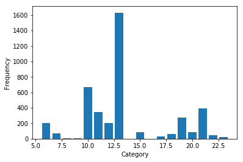

# Reference PyTorch GraphSAGE Implementation
### Author: William L. Hamilton

Basic reference PyTorch implementation of [GraphSAGE](https://github.com/williamleif/GraphSAGE).
This reference implementation is not as fast as the TensorFlow version for large graphs, but the code is easier to read and it performs better (in terms of speed) on small-graph benchmarks.
The code is also intended to be simpler, more extensible, and easier to work with than the TensorFlow version.

Currently, only supervised versions of GraphSAGE-mean and GraphSAGE-GCN are implemented. 

#### Requirements

pytorch >0.2 is required.

#### Running examples

I have changed the code to satisfy the movieLens dataset recommendation and I have two plans to do the embedding part so far.

#### Evluation Metircs
In binary classification problem, GraphSage achieves about 80% accuracy.
The distribution of movie category before DPP and after DPP:

Before Determinantal Point Processes

After Determinantal Point Processes

